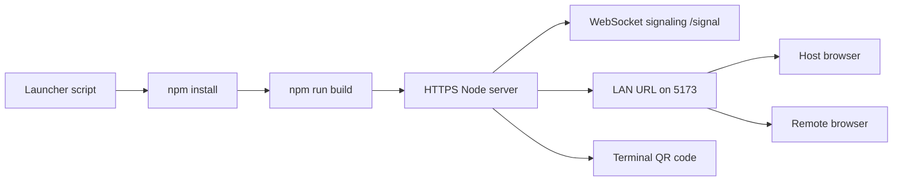

# Architecture

## Notes

- The launcher is the stable part of the system.
- The app is built once and then served as static assets over HTTPS.
- The Node launcher binds to `0.0.0.0` so other devices on the LAN can reach it.
- Camera and microphone access require the HTTPS launcher path.
- The app is intended for a direct two-device call, not a room or group chat.
